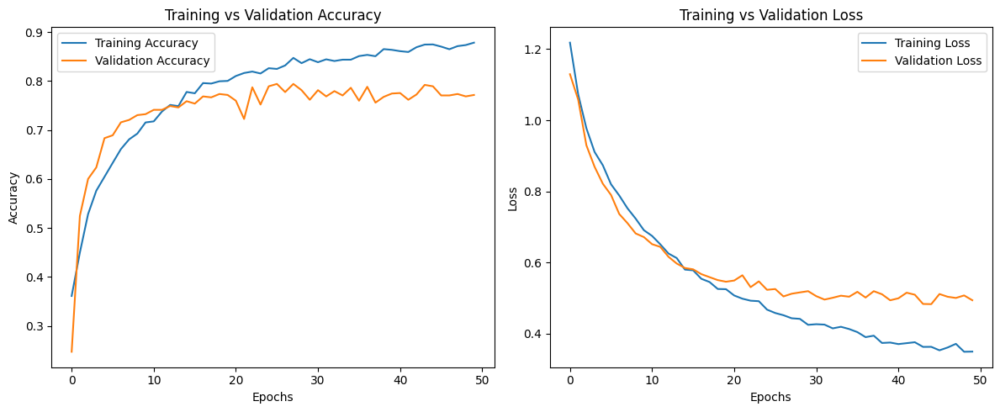

# Model 1

## Architecture

```python
# Build CNN Model
model = Sequential([
    # First Conv Layer
    Conv2D(16, (3,3), activation='relu', input_shape=(224, 224, 3), kernel_regularizer=l2(1e-4)),
    BatchNormalization(),
    MaxPooling2D(pool_size=(2,2)),

    # Second Conv Layer
    Conv2D(31, (3,3), activation='relu', kernel_regularizer=l2(1e-4)),
    BatchNormalization(),
    MaxPooling2D(pool_size=(2,2)),

    # Third Conv Layer
    Conv2D(64, (3,3), activation='relu', kernel_regularizer=l2(1e-4)),
    BatchNormalization(),
    MaxPooling2D(pool_size=(2,2)),

    # Flatten(),
    GlobalAveragePooling2D(),

    # Fully Connected Layer
    Dense(128, activation='relu'),
    Dropout(0.5),

    # Output Layer
    Dense(3, activation='softmax')  # 3 classes
])

# Compile the model
optimizer = Adam(learning_rate=1.3e-5)
model.compile(optimizer=optimizer, loss='categorical_crossentropy', metrics=['accuracy'])

# Model Summary
model.summary()
```

## Training

```python
from tensorflow.keras.callbacks import ReduceLROnPlateau

reduce_lr = ReduceLROnPlateau(monitor='val_loss', factor=0.5, patience=5, min_lr=1e-6)

EPOCHS = 50 # Number of epochs

# Train the CNN model
history = model.fit(
    train_data,
    validation_data=val_data,
    epochs=EPOCHS,  # Adjust based on performance
    steps_per_epoch=len(train_data),
    validation_steps=len(val_data), # Add early stopping callback
    callbacks=[reduce_lr],  # Reduce learning rate on plateau
)

# Final Training & Validation Accuracy and Loss
train_acc = history.history['accuracy'][-1]
val_acc = history.history['val_accuracy'][-1]

print(f"Final Training Accuracy: {train_acc:.4f}")
print(f"Final Validation Accuracy: {val_acc:.4f}")
```

## Evaluation

Final Training Accuracy: 0.8784 <br>
Final Validation Accuracy: 0.7716 <br>
Validation Accuracy: 0.7716 <br>
Validation Loss: 0.4942

## Graph


